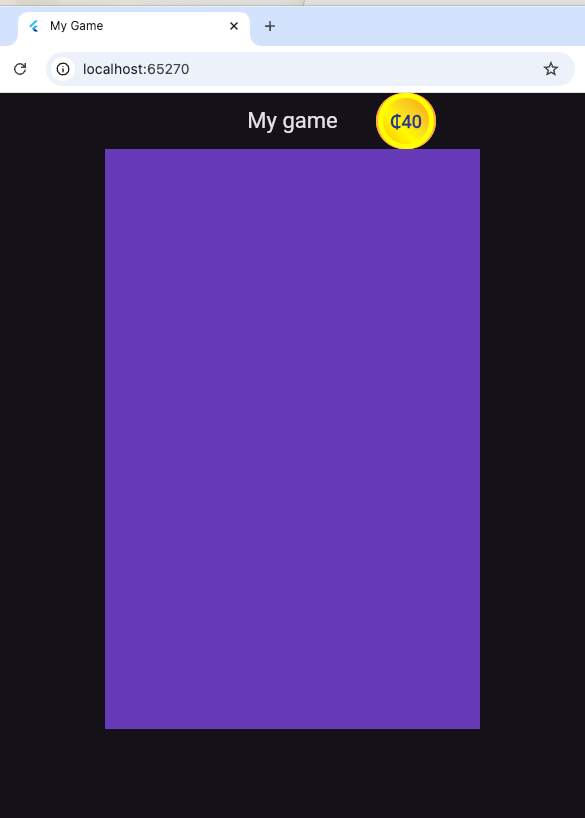
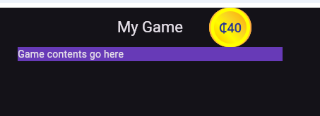
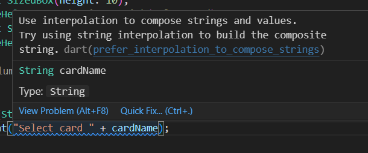
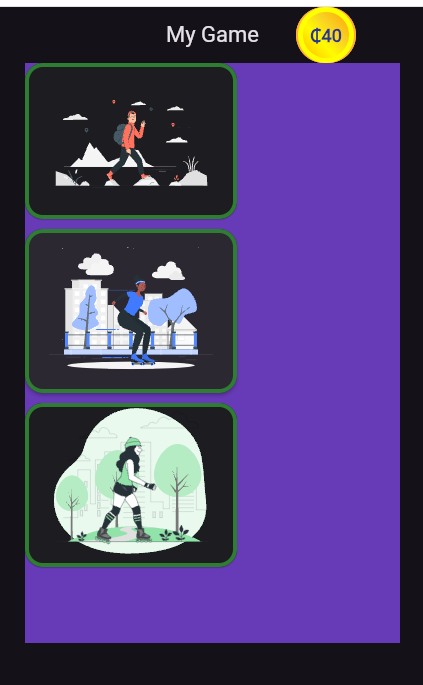
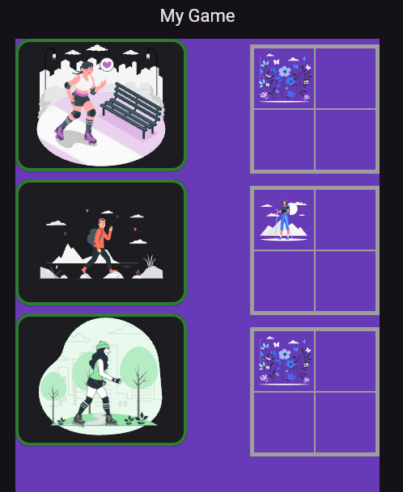
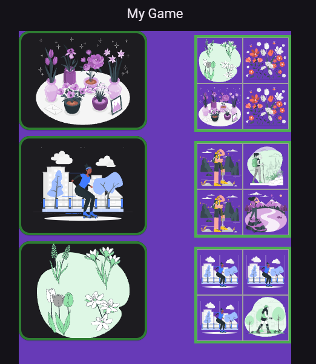
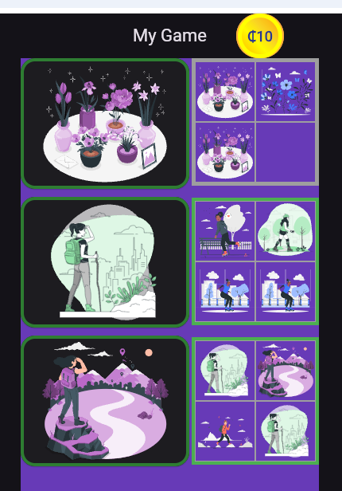

# mobile_game

A workshop for beginners, where you get to build your own flutter game

## About Flutter

Flutter is a programming language that runs... anywhere! But most importantly, you can run
it on your mobile phone.

In this workshop, we'll provide you with the scaffolding to write your first flutter code. 

# Setup

Before you start, you need a working developer environment with flutter, and a copy of the code
for the workshop.

This might have been done for you, TODO how to check

If not, here is how to set up a working development environment for this workshop 
https://github.com/fflowio/mobile-game/blob/main/README_SETUP.md

# Code

When you start this workshop, you already have an IDE open. At the left-hand side is a list
of files, there are a lot. But there is good news, you can ignore most of them!

## Flutter-generated files

Flutter comes with lots of files that support the way your code works with a phone. They are 
generated for you every time you create a new flutter project. For this workshop, you don't need
to worry about them.

## Folders, files and other structure

When you write a code project, it generally ends up being quite long. You'll notice there are 
already a lot of files, and you haven't even started yet! But if all the code was in one
single file, it would look even messier.

Developers tidy and structure their code by splitting it up. It's a bit like writing a book, or
even a series of books. There's no absolute rule about where and how to split up your code, but
in my head, it goes a bit like this:

| Code                | Literature   |
| ------------------- | ----------   |
| Folder / directory  | Book         |
| File                | Chapter      |
| Method / function   | Paragraph    |

A method, also called a function, is generally related to a single thought or action, with several 
methods in a file, and several files in a folder.

In this workshop, you will work on several functions, all in the game.dart file.

## Workshop files

We have provided files which give you a framework and some useful helper functions, and a game
file where you will write your code.

They are all in the lib/ folder, as follows:

- lib/main.dart
- lib/views/game.dart [here is where you will work]
- lib/views/credits.dart
- lib/components/widgets.dart
- lib/components/image_helpers.dart

You'll find out more about them in the workshop.

## 1 Run the blank project

Run the project. There isn't much to see yet, that's because you will be coding it in the next steps.
But let's just see the blank project first!

### 1A VSCode

#### 1.1 Run the game (VSCode)

With your IDE open, press F5. 

If nothing happens, go to the menus at the top of VSCode and select Run -> Start Debugging

You will be asked to choose where to run:

- If you have configured an emulator or connected a mobile phone, choose it
- Otherwise, choose Chrome

### 1B Android Studio

In Android Studio, at the top of the screen, in the middle you'll see some menus. The look like this:


#### 1.1 Run the game (Android Studio)

If you have configured an emulator, or connected a mobile phone, select it. 

Otherwise, use the first option: Chrome (web), and you'll run this workshop in a browser.

   Select run options

      Chrome(web) in the first menu [or your device, if you have one]
      main.dart in the second menu 

   Run

       Click on the green triangle next to the third menu

#### 1.2 Check it's all working

You should see something like this:



## A short explanation of the code provided

### Imports

At the top of game.dart, you'll see some imports, these are helpers you'll need later on.

### Classes

Next come two classes:

```class Game extends StatefulWidget {```
and
```class _GameState extends State<Game> {```

State is the way a mobile app remembers information between one click and the next. Without it,
everything would always go back to the beginning and start again. 

### Methods

To find a method, look for round brackets () and the squirly brackets {} like this:

```
methodName() {
}
```

The round brackets () hold parameters, information that you will pass into the method.
The squirly brackets {} mark the beginning and end of the code that happens in the method.

Most of your code will go inside a method, that is, between { and } for a method()

Methods must go inside a class, which also has { and }

The second class, _GameState, has two methods,:

```
Widget welcome() {
```

and

```
@override
Widget build(BuildContext context) {
```

@override means there's code inherited from flutter that does things for you: and you can 
choose to change them if you don't like the defaults.

All your code will be written in this file, lib/views/game.dart.

Let's get started.

## 2. First changes

### 2.1 Name

Choose a name for your game.

Find this line in the Game class. It's global, so it's not inside any method:

```
  static var name = "My Game";
```

#### 2.1.1 Change "My Game" to your chosen name for the game

The browser now shows your chosen name in two places!

### 2.2 Background color

Choose a background color for your game

Find this line in the build() method:

```
color: Colors.deepPurple,
```

#### 2.2.1 Try different colors

Change Colors.deepPurple to Colors.green

Change it again, from Colors.green to Colors.deepOrange

Did you notice anything while you were typing? Your IDE started helping you, by telling you what 
colours it knows about.

Try a few different colours.

This app is in dark mode, which means it has white text, so it's best to use a dark 
background. It's impossible to see white text on a white background!

### 2.3 Comments

#### 2.3.1 Comment out the color line

Use // to comment out the color line, it will end up like this:

```
// color: Colors.purple,
```

What happened when you commented the color line?

All programming languages have a way of writing comments, usually so that you can explain what's
happening to other developers. Comments are also useful to remove code temporarily, like you just did.

Remove the comment marker (//), and turn it back to purple or your preferred dark colour.

## 3. Welcome

### 3.1 welcome method

Edit the welcome method to show a welcome page

#### 3.1.1 Add the new welcome contents

Inside the welcome() method, where the Column is, add children in side the return Column, between
( and ):

```  
    children: [
      const SizedBox(height: 50),
      ImageHelpers.getPicture("assets/images/StoryboardAmico.svg", 300),
      const SizedBox(height: 50)
    ]
```

When you've done it, the whole method looks like this:

``` Column welcome() {
    return Column(
      children: [
        const SizedBox(height: 50),
        ImageHelpers.getPicture("assets/images/StoryboardAmico.svg", 300),
        const SizedBox(height: 50)
      ]
    );
  } ```

And in a browser, the result looks like this:


## 4. Start playing

The app needs a button to get the game started.

In the welcome() method you just created

### 4.1 Add a start button

#### 4.1.2 Add a comma

Add a comma to the last SizedBox in the welcome method, so it looks the same as the first SizedBox,
like this:

```const SizedBox(height: 50),```

#### 4.1.3 Add the start button

Below the comma, add this line:

```
Widgets.defaultButton(resetGame, "Start")
```

Your IDE will show up with an error immediately! Why? What have you done?

You've told the app to add a button with a label "Start", and when you press it, it will call a method
"resetGame". But there is no resetGame method, or not yet! Add it now.

### 4.1.4 Reset game method

This new method goes inside the _GameState class, but outside any other methods. 

It's a good idea to put an empty line above and below every new method, so you can see where it 
starts and finishes.

The order of methods doesn't matter, but it helps to keep related methods nearer to each other,
mainly so that you or another coder can find them easily.

When these instructions say "near", you can add the new code either above or below the nearby method.

Add this new method near the welcome() method.

```
void resetGame() async {
  debugPrint("Reset");
}
```
This fixes the error, and you have a green Start button now! What happens when you press it?

4.1.5 Debug

Look at the foot of your screen, in the console. 

In VSCode, select the Debug Console tab

In Android Studio, select the Run tab

The method doesn't do anything yet - but you can tell if it's working, because in the Run console, 
you see the word Reset.

This is because you added a line of debug, using the flutter method debugPrint(). 

Developers use debug to work out what's going on in their code, and what's going wrong. Typically,
you turn off debug statements when you get into production. But at the moment, you're the only 
person seeing this code, and debug statements are useful for you to work out what's working,
and what isn't. 

Any time something doesn't work, add your own debugPrint output, and see if you can work
out what's happening!

## 4.2 Start the game

Time to get the game started!

At the moment, the game always shows welcome page. Let's change it to return a 
game page when the user starts playing.

### 4.2.1 Add pageContents() 

Add a new method:

```
  Widget pageContents() {
    if (_showContents == "start") {
      return gamePage();
    } else {
      return welcome();
    }
  } 
```

The IDE shows two errors now! Can you guess why?

Your code mentions two new things, _showContents, and gamePage(), and they don't exist yet. You 
will add them next.

By the way, it's absolutely normal to see errors while you work on code. They look scary, especially
if they are bright red. This workshop shows you some on purpose so that you get used to them.

### 4.3 Add gamePage()

Add a gamePage method near the pageContents and welcome methods, like this:

```
Row gamePage() {
  debugPrint("Game");
  
  return Row(
    mainAxisAlignment: MainAxisAlignment.spaceBetween,
    children: [
      Text("Game contents go here")    
    ]
  );
}
```

This should fix one of the errors, but there's still one more.

### 4.4 Add _showContents

Flutter uses _ to mark something as private. The app already has one private method, _GameState.
Private just means you can only call it from inside the same class.

We use private methods and variables to stop data from leaking into other bits of the app.

Although this showContents is a private variable, we want to use it in several different methods
in this class. If you declare a variable inside a method, only that method can use it.

We want to use showContents in several methods, so it needs to be declared outside all of them.

By convention, we add class-wide variables at the top of the class, so anyone new to the class will
see them quickly.

At the top of the (private) _GameState class, above all the methods, add this line:

```
String _showContents = "welcome";
```

All the errors should be fixed, but there are still warnings. Ignore them for now, you will fix
them soon.

### 4.5 Call pageContents

In the build() method, change the Container child so it returns pageContents() instead of welcome(),
like this:

```child: pageContents()```

If you test by clicking the Start button, you'll notice that the page contents don't actually change.
 
That's because there isn't any code to change the value of _showContents, so it is always "welcome".

Move on to the next step to fix this.

### 4.6 _showContents logic

You have code for two different bits of content: gamePage() and welcome(). But at the moment,
you can still only see the welcome page. Iit would be handy to see the game page too.

How do you fix this? 

First, try changing the value of _showContents

#### 4.6.1 Change _showContents 

In the resetGame() method, add this line at the bottom:

```
  _showContents = "start";
```

But... still nothing changes when you press the Start button!

What has gone wrong?

Remember the debugPrint message? It's still there, and it shows you did call the resetGame() method,
each time you click the start button. (It's a good idea to check this, sometimes the
reason code isn't working is simply that you are not calling it.)

But debug shows you did call it, so there must be a different problem. 

### 4.6.2 Set _showContents in state

You don't only want to the change the value of _showContents, you also want to redraw the page 
contents. In flutter, the way to get the page to redraw is to change the state. 

At the end of resetGame(), add a call to set the state:

``` 
  setState(() {  });
```

## 4.7 Does it work?

Click the Start button again. Now it should work, and you see the "Game contents go here" text.
Like this:



Ooops, the page is a bit short. Never mind, the contents are only temporary, we'll fix it when we 
build out the real thing.

### 4.8 Inheritance

So far in this workshop, when you call a method, if it doesn't exist, you get an error. But here, 
there's no error, and it just starts working. But you haven't written a setState() method. How does 
this happen?

Look at the top of the class, it looks like this:

```class _GameState extends State<Game> {```

The State class you are extending includes the setState() method, which is why you don't need to 
build it. Someone else already wrote it!

It's called inheritance: you inherited the setState method from the parent State class.

Inheritance is powerful. It means you can reuse your own or someone else's code, without having to
care how the insides work.

## 5. Game page

Let's add some contents in the game page.

### 5.1 Cards to choose from

The game invites the user to pick a card. So let's give them some cards to choose from.

In the gamePage() method, delete the Text line:

~~```Text("Game contents go here")```~~

change the Text line to call cardsToChoose()

```
cardsToChoose()
```

#### 5.1.2 Add cardsToChoose method

  Near the pageContents() method, add a new cardsToChoose() method

```
  Column cardsToChoose() {
    return Column(
      children: [
        ImageHelpers.randomPictureLink(selectCard),
        const SizedBox(height: 10),
        ImageHelpers.randomPictureLink(selectCard),
        const SizedBox(height: 10),
        ImageHelpers.randomPictureLink(selectCard)
      ]
    );
  }

```
Shame, the errors are just getting worse! You fixed the cardsToChoose() error, but now there are
three selectCard errors instead. 

Take a quick look in the image_helpers.dart file at the randomPictureLink method. A helpful
comment at the top says you need to provide a selectCard method. You'd better do that now!

### 5.2 selectCard

Add the selectCard() method now, near the cardsToChoose() method

```
selectCard(String cardName) {
  debugPrint("Select card " + cardName);
}
```

### 5.3 Fix the warning

Your IDE will give you a warning about using String interpolation. String interpolation syntax
can be a bit fiddly, but luckily, we don't need to worry about the details!

Hover over the String line, the IDE will offer a helpful message, like this (VSCode):



Click on 

```Quick fix...```

Or this (Android Studio):


Click on 

```Replace with interpolation```

Once it's fixed, it should look like this:

```debugPrint("Select card $cardName");```

If the IDE magic doesn't work, you can fix it by hand: but often, it saves research and typing to
use the IDE suggestions.

### 5.4 Does it work?

Click on the start button. Your app should look like this now!



The image generator code is random, so your images will be different. But the layout should be the 
same as this screenshot.

The images are all provided in the assets/images folder. Thanks and credits to https://storyset.com

## 6. Game logic

### 6.1 Sets

The game is to build sets of matching cards.

Configure the sets where the code will store them.

Like _showContents, they need to be private, and shared with all the methods in the class.

### 6.1.1 Set variables

Add these sets near the _showContents variable, at the top of the _GameState class

```
List<String> _set1 = [];
List<String> _set2 = [];
List<String> _set3 = [];
```

## 6.2 Initial set logic

The images we're using come in sets of 4, so a set in the game will have a maximum size of 4.

Let's start with the basics: if the set is empty, the new card can go in it. If it has reached 4, 
and is full, the new card can't be added. If the set has 1,2, or 3 cards, you need some more logic, 
which you'll add soon. For now, just add a debug statement as a reminder.

Add a new cardCanGoInSet() method near the selectCard() method, that works out whether a set is 
full or empty:

```
bool cardCanGoInSet(String cardName, List<String> set) {
  if (set.length == 4) {
    return false;
  } else if (set.isEmpty) {
    return true;
  } else {
    debugPrint("Set has 1 or more cards");
    return false;
  }
}  
```

## 6.3 More set logic

Add a new method addCardToNextAvailableSet(), near the cardCanGoInSet() and selectCard() methods.

```
  addCardToNextAvailableSet(String cardName) {
    debugPrint(cardName);
    if (cardCanGoInSet(cardName, _set1)) {
      _set1.add(cardName);
    } else if (cardCanGoInSet(cardName, _set2)) {
      _set2.add(cardName);
    } else if (cardCanGoInSet(cardName, _set3)) {
      _set3.add(cardName);
    } else {
      debugPrint("CARD DOES NOT FIT ANYWHERE");
    }
  }
```

## 6.4 Call the new logic

In the selectCard() method, add this line:

```
  addCardToNextAvailableSet(cardName);
```

This might be working now, but you can't really tell, because all the changes are in the sets,
which are not visible. 

You could add debugPrint to check the sets are being filled.

Or, just skip on to the wallet, where you will display the set contents. Once the wallet is
shown, you'll find out pretty quickly if the sets are working or not.

## 7. Wallet

### 7.1 Wallet contents

The app shows cards to choose from in the left-hand side of the view. This means we can add the 
wallet in the right-hand side.

Near the gamePage() method, add a new method that shows the set contents

```
Column wallet() {
  List<Widget> contents = [
    Widgets.setContainer(_set1),
    const SizedBox(height: 8),
    Widgets.setContainer(_set2),
    const SizedBox(height: 8),
    Widgets.setContainer(_set3)
  ];

  return Column(
    mainAxisAlignment: MainAxisAlignment.start,
    children: contents
  );
}
```

### 7.2 Call the wallet

What's with all these commas?

You'll see quite a lot of commas in this workshop, and here's a mini explanation.

Many programming languages use square brackets to mark the beginning and end of a list, and most 
of them call it an Array. 

In flutter and dart it's called it a List. But it's the same thing. Like this:

[a, b, c, d]

When you want to add a new entry in the List, you add a comma to separate it from the entry before.
Like this:

[a, b, c, d, e]

If the contents are a bit longer, for example:

[apple, banana, cherry, dinosaur]

To help see where each entry starts, you can choose to split the contents over different lines. 
This just makes it easier to see where each entry starts. It doesn't affect how the List (or Array)
works.

```
[
  apple,
  banana,
  cherry,
  dinosaur,
  elephant
]
```

We mostly use this style for the code in this workshop! Let's add a comma and element.

In the gamePage() method, the Column has a List of children, shown by [ and ].

Add a comma after cardsToChoose(), and then this line:

```
  wallet()
```

### 7.3 Is it working?

In the chrome browser, click Start, then click on one of the cards on the left.

The wallet code is working, you can see it shows grey boxes where the cards will be added, so it's
getting called. But it's not displaying the cards from the set contents. Why not?

It's the state problem again!

After you update the sets, you need to update them in the widget state, so it knows to include 
them when it redraws.

### 7.4 Set state

You could add this in the addCardToNextAvailableSet() method. But that one is going to get
pretty full of logic so to keep it a bit easier to read, we'll add it to the place that calls it.

In selectCard(), under addCardToNextAvailableSet(), add this call to setState:

    setState(() { });

### 7.5 Is it working?

Now the wallet updates with the cards from the set! It should look something like this:



It's working, but, because we only added logic to add the first card to any set, they only 
ever have one. 

Next, you'll revisit the set logic to add cards 2, 3, and 4

## 8 More set logic

### 8.1 Add them all

In cardCanGoInSet() method, in the last else statement, there's a debug and you return false, 
which means you don't allow the card to go in the set.

What happens if you change it to true?

```return true;```

Now you can fill up the sets to get to 4, but ... they aren't matching sets. 

You need more logic to make sure they match.

### 8.2 Test the category

In order to belong in a set, a card needs to be from the same category.

Add a new categoryMatch() method near the cardCanGoInSet() method

```
bool categoryMatch(existingCard, newCard) {
  return existingCard.substring(14, 21) == newCard.substring(14, 21);
}
```

Our cards have a category as part of their name, and this line tests if the name parts are equal.
To understand how this method works in more detail, add debug. For example:

```debugPrint(existingCard.substring(14, 21));```

### 8.3 Call the card category match

In the cardCanGoInSet() method, add an 'else if' statement, which uses the categoryMatch() test to 
find out if this card fits in the set. 

Once you've added the new 'else if', the whole method contents look like this:

```
  if (set.length == 4) {
    return false;
  } else if (set.isEmpty) {
    return true;
  } else if (categoryMatch(set[0], cardName)) {
    return true;
  } else {
    debugPrint("Set has 1 or more cards");
    return false;
  }
```

### 8.4 Does it work?

Now, the card you select should only join a set if it matches. And you should be able to fill up
all the sets, like this!



## 9.0 Ending the game

But wait, the game never ends! It keeps trying to add cards, and continues without adding, because 
all the sets are full.

### 9.1 Refactor sets

We're about to add some logic to all the sets. 

In the addCardToNextAvailableSet(), there are 'if' statements that basically do the same thing for 
each set. It's starting to look messy, and we want to make the contents of the 'if' longer.

Instead, first, we'll make a minor refactor and keep track of all the sets together.

#### 9.1.1 List of Lists

When you have a List, captured between square brackets: 

[a, b, c]

It turns out, you can use a List inside a List, like this: 

[[a,b,c], [b,c,d], [f,g,h]]

We're going to do this with the card sets.

#### 9.1.2 Add a sets list

At the top of the GameState class, add a new sets list near the other sets 

```
  List<List<String>> _sets = [];
```

You can try changing the line you just added:

```
  List<List<String>> _sets = [_set1, _set2, _set3];
```

... but you'll get errors! The instance member can't be accessed in an initializer

Basically, it just means it's too soon to add those contents.

#### 9.1.5 Undo

Press Ctrl and Z at the same time (windows) or Cmd and Z (mac). What happens?

Ctrl-Z (Cmd-Z) is a really useful way to undo something if you make a mistake or change your mind.

Back up the code to the first version:

```List<List<String>> _sets = [];```

#### 9.1.6 Add the sets to the bigger list.

Instead, set up the sets when we reset the game

Add this content into resetGame(), near _showContents, and before setState():

```
  _set1 = [];
  _set2 = [];
  _set3 = [];
  _sets = [_set1, _set2, _set3];
```

### 9.2 For loop

In the addCardToNextAvailableSet() method, now we can use a for loop instead of checking each set 
separately.

Change the contents of the method to this:

```
    for (var set in _sets) {
      if (cardCanGoInSet(cardName, set)) {
        set.add(cardName);
        return;
      }
    }
```    

#### 9.2.1 Does it work?

The idea behind a refactor is that the code ends up neater, but the function still works exactly
how it did before.

So it's important to check everything still works before you move on - including old bugs. But
you should not have added any new bugs!

Check that you can still play the game and add cards to the wallet. The game still runs forever,
you haven't fixed that yet. You'll do that next!

### 9.3 Track full sets

Keep track of when the sets are full.

Near the _set variables at the top of the class, add a new private fullSets variable

```
  int _fullSets = 0;
```

In the addCardToNextAvailableSet() method, if you just added the 4th card, update the full set count

Under set.add(cardName, add this:

```
      if (set.length == 4) {
        _fullSets += 1;
      }
```

#### 9.3.1 When are all the sets full?

In the selectCard() method, at the end, check if the sets are full, and if they are, change 
to the finish page (which doesn't exist yet, but we'll get to that)

```
    if (_fullSets == 3) {
      _showContents = "finish";
    }
```


#### 9.3.2 Reset fullSets

When the game resets, also set _fullSets back to zero. Add this line in resetGame():

```_fullSets = 0;```

#### 9.3.3 Does it work?

Sort of.

If you run the game until all the sets are full, it ... goes back to the welcome page!

Why?

Look at the logic in pageContents()

It only ever calls either the game page or the welcome page. You need to update it to call a 
finish page. Let's build the contents first.

### 9.4 Finish page

#### 9.4.1 Add the finish page

Near the pageContents() method, Add a new finishPage() method to congratulate the player

```
  Widget finishPage() {
    String result = "You completed " + _fullSets.toString() + " sets!";

    List<Widget> children = [
      const SizedBox(height: 40),
      Text(
        "Congratulations!!",
        style: Widgets.celebrateTextStyle
      ),
      Text(result, style: Widgets.subTextStyle),
      const SizedBox(height: 40),
      Widgets.defaultButton(resetGame, "Play again"),
      const SizedBox(height: 40)
    ];

    children += (Credits.contents());

    return Column(
      children: children
    );
  }
```

#### 9.4.2 Fix the warning

You'll see an interpolation warning about the line that starts 'String result'

Do you remember using the IDE to help fix the interpolation warning?

Use the same trick again, and your code changes to this:

```String result = "You completed $_fullSets sets!";```

### 9.5 Call the finish page

In the pageContents() method, between the top 'if' and the bottom 'else', add an 'else if' test, and set
it to call finishPage. You should end up with the whole method looking like this:

```
    if (_showContents == "start") {
      return gamePage();
    } else if (_showContents == "finish") {
      return finishPage();
    } else {
      return welcome();
    }
```

### 9.6 Does it work?

Run the game through, do you get to the new finish page?

Excellent!

But at the moment, every player will fill all three sets, every time. It's nice to win, but
if everyone always wins, it's not much of a game.

Let's fix that next.

## 10. Coin logic

### 10.1 Count coins

There's already a coin widget in the navbar, but at the moment, it always says "40".

Let's make it more intelligent.

#### 10.1.1 Coins variable

At the top of the class, where we declare _sets and _fullSets, add a line with the coins variable

```
int _coins = 120;
```

### Reset coins

When the game starts, reset the coins value. In resetGame(), add this line:

```
   _coins = 120;
```

#### 10.1.2 Update coins

Every time the user selects a card, subtract some coins. In the selectCard() method, add this:

```
   _coins -= 10;
```

#### 10.1.3 Check when the user runs out of coins

Better check in case we got to zero!

In the same selectCard() method, after subtracting coins, test how many are left:

```
    if (_coins == 0) {
      _showContents = "finish";
    }
```

#### 10.1.4 Remove the old fullSets check

This means we don't need the fullSets check any more. It's not doing any harm, but it's always
a good idea to remove code you don't need any more. It means there's potential for something
to break, and it can confuse someone reading this code for the first time.

Delete these lines:

~~
  ```
    if (_fullSets == 3) {
      _showContents = "finish";
    }
  ```
~~

#### 10.1.5 Display coins

Show the user how their coins are going: in the build() method at the end of the class, find
where the customAppBar is called, and update it to send the coins instead of the number 40.
 
It should end up like this:

```Widgets.customAppBar(Game.name, _coins),```

### 10.2 Does it work?

Play the game.

It should look something like this:



Make sure that when you get to the end, you restart the game, and the coins go back to 120.

Congratulations!! You have completed the workshop.

# Stretch goals

## 11 Make the card logic more interesting

If you look in /assets/images the image names look like this:

JourneyAmico.svg
JourneyBro.svg
...
RollersAmico.svg
RollersBro.svg

This means, we can match based on type (Amico, Bro), as well as the category (Journey, Rollers)

### 11.1 Add a typeMatch test

Near the categoryMatch method, add this:

```
bool typeMatch(setCard, newCard) {
  return setCard.substring(21, 24) == newCard.substring(21, 24);
}
```
### 11.2 Improve the card matching logic

In the cardCanGoInSet() method, you need a lot more logic.

What happens if there is one card in the set?

What happens if there are two or three cards in the set?

How do you know if a set was a category set or a type set?

Try and work it out yourself before you read on....

### 11.3 Possible solution

Here's my solution:

```    
    if (set.length == 4) {
      return false;
    } else if (set.isEmpty) {
      return true;
    } else if (set.length == 1)  {
      if (categoryMatch(set[0], cardName)) {
        return true;
      } else if (typeMatch(set[0], cardName)) {
        return true;
      }
    } else if (categoryMatch(set[0], set[1])) {
      if(categoryMatch(set[0], cardName)) {
        return true;
      }
    } else if (typeMatch(set[0], set[1])) {
      if(typeMatch(set[0], cardName)) {
        return true;
      }
    }

    return false;
  }
```

It works, but having so may 'else if' tests feels inefficient. Your solution might be more elegant.

### 11.3 Does it work?

Play the game. Can you get to the end? What has changed?

## 12 More ideas

## 12.1 Improvements

What ideas do you have to improve this game? How would you change the styling? Would you 
draw your own images?

## 12.2 Go big

What would you build if you were designing a new game?

Or would you build an app that does something useful?

Here are some [other projects](https://www.geeksforgeeks.org/flutter-projects-with-source-code/) 
that might give you ideas


